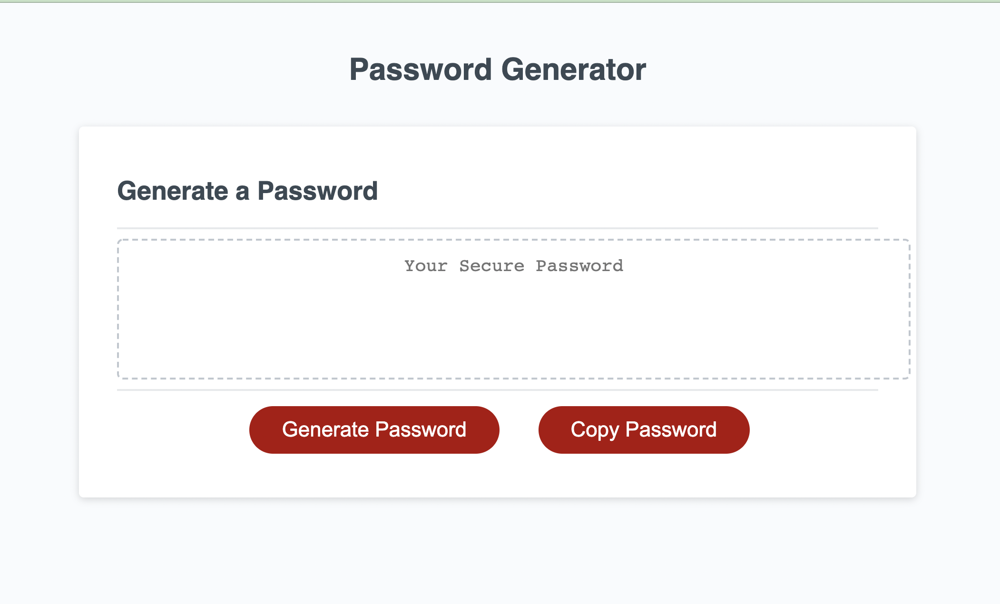
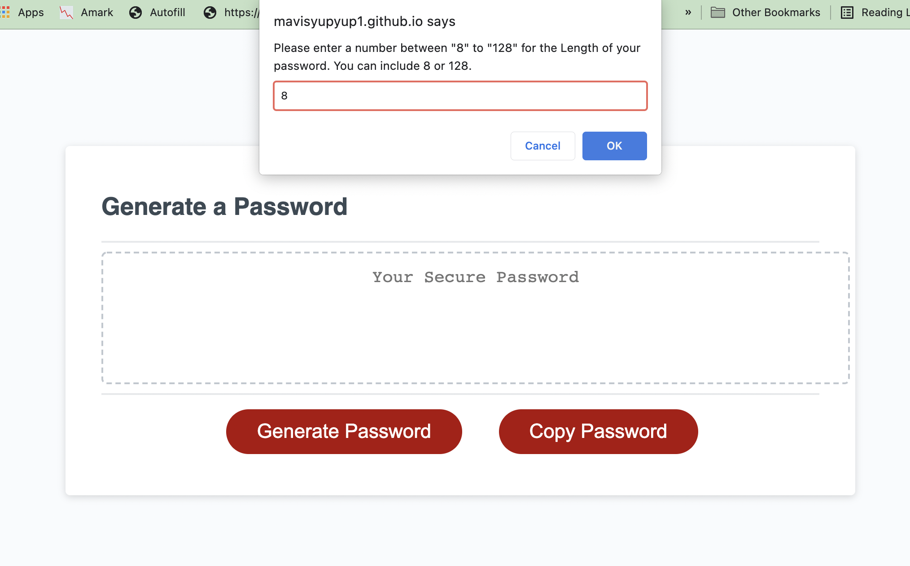
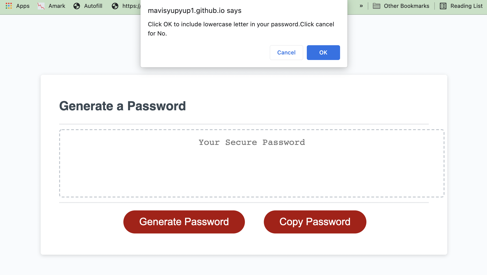
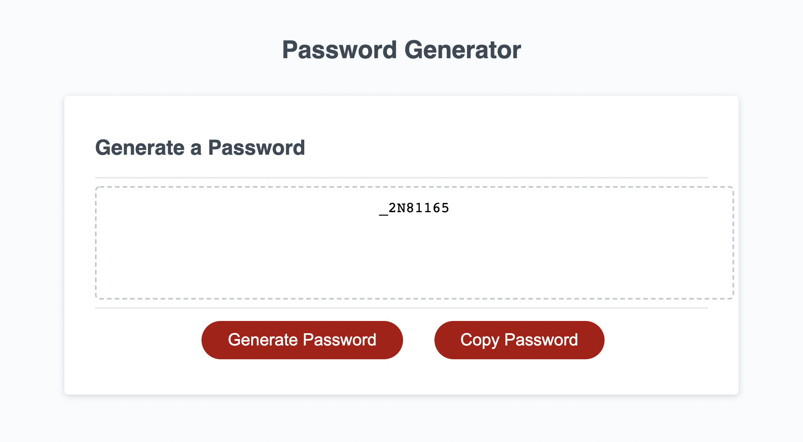
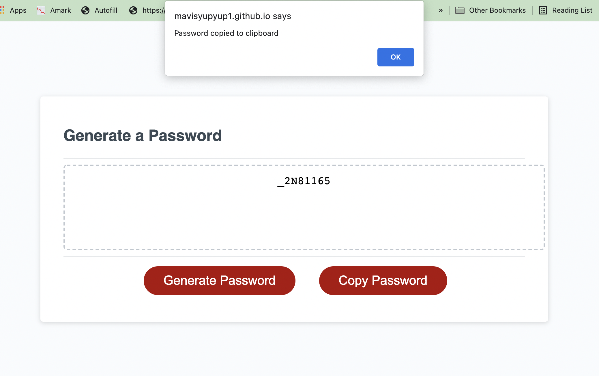

# Password Generator
## Description

The application is for an employee to generate a random password based on selected criteria (length of password and type of characters to include). Then a password will be generated and displayed on the page. User can click the copy button to copy password to clipboard. The app runs in the browser, features dynamic HTML & CSS and is powered by JavaScript.

## Built with
* HTML
* CSS
* JavaScript

## Screenshots
* Initial Screen

* Input length

* Select type to include

* Generate password

* Copy to clipboard

## Website
https://mavisyupyup1.github.io/passwordgenerator/

## Contribution
Start Code: https://github.com/coding-boot-camp/friendly-parakeet
